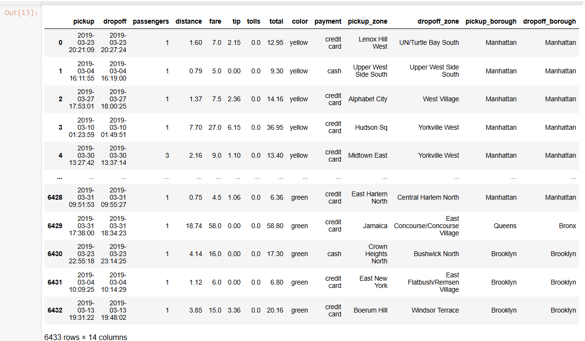
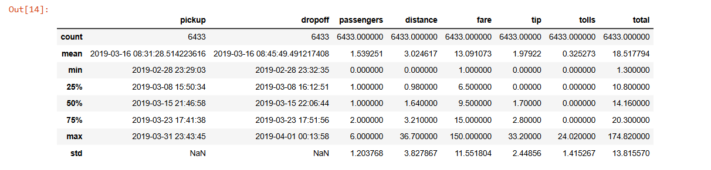
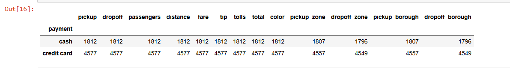
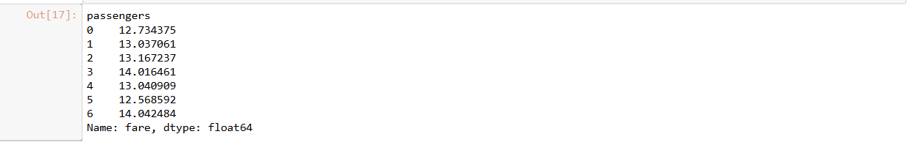
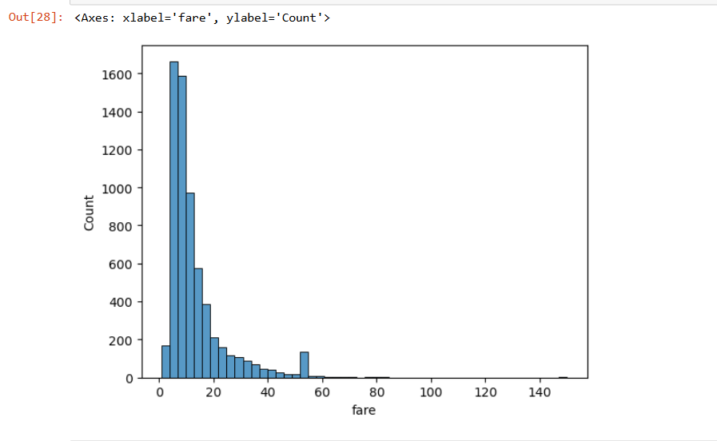
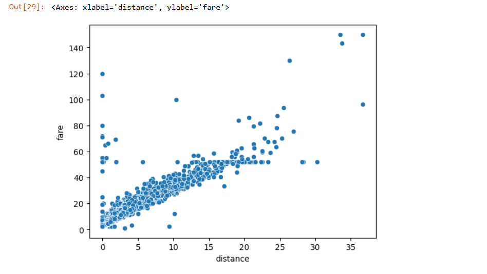

# 🧠 Python for Data Visualization

This project explores how to analyze and visualize taxi data using Python. The dataset includes details like fare amount, passenger count, payment type, and more. We use libraries such as **Pandas**, **Matplotlib**, and **Seaborn** for analysis and charting.

---

## 📥 Importing the Data

import pandas as pd
df = pd.read_excel(r"\Users\User\Documents\Python Data Analysis Project (3 May 2025)\Taxis_Data.xlsx")
df

#for describe the data(all the means, max, std deviation)
df.describe()

#what are the payment types taxis have?
df.groupby("payment").count()

#what's the average fare by number of passengers?
df.groupby("passengers")["fare"].mean()

#whats the average fare by taxi color
df.groupby("color")["fare"].mean()

#for data visualization part, we need to have library such as matplotlib
!pip install seaborn matplotlib
import seaborn as sns
import matplotlib.pyplot as plt
#create a chart with the fare distribution
sns.histplot(df["fare"], bins=50)

#is there a relationship between fares and distances?
#use scatter to show the relationship
sns.scatterplot(x="distance",y="fare", data =df)

💡 Insight: As distance increases, fare tends to increase — showing a positive correlation.
